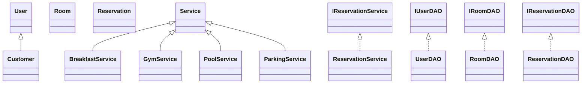
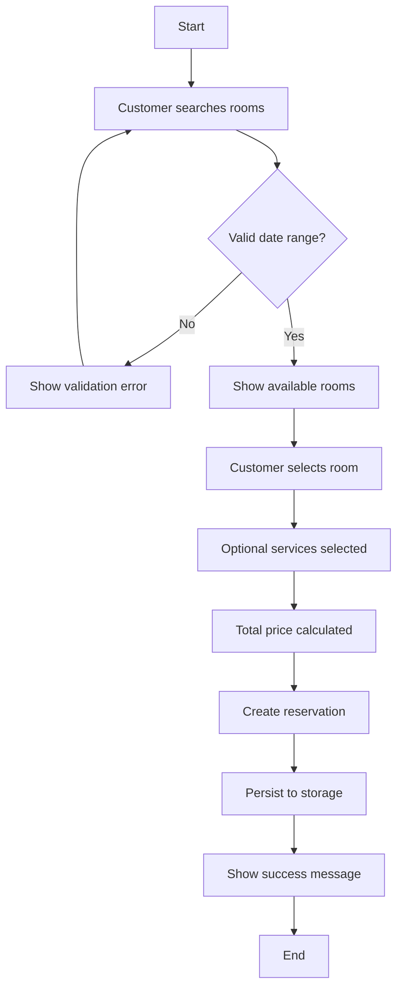

# UML Diagrams

## Use Case (Textual)

- Customer:
  - Login
  - Search room
  - Make reservation
  - View/cancel own reservations
- Admin:
  - Login
  - Manage rooms (CRUD)
  - Approve/cancel reservations
  - View reports

## Class Diagram (Mermaid)

## Activity (Reservation Flow)

